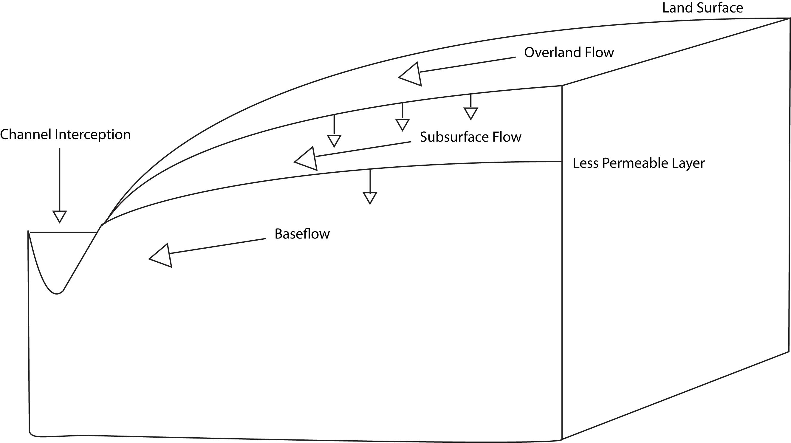
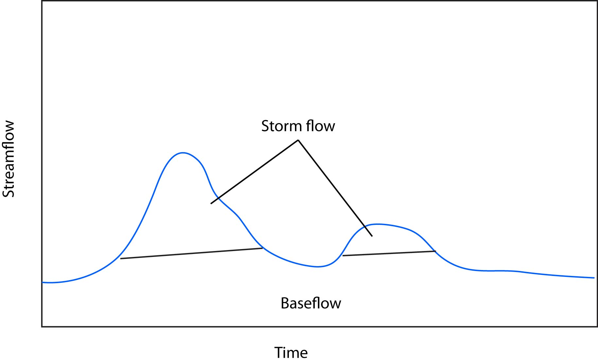
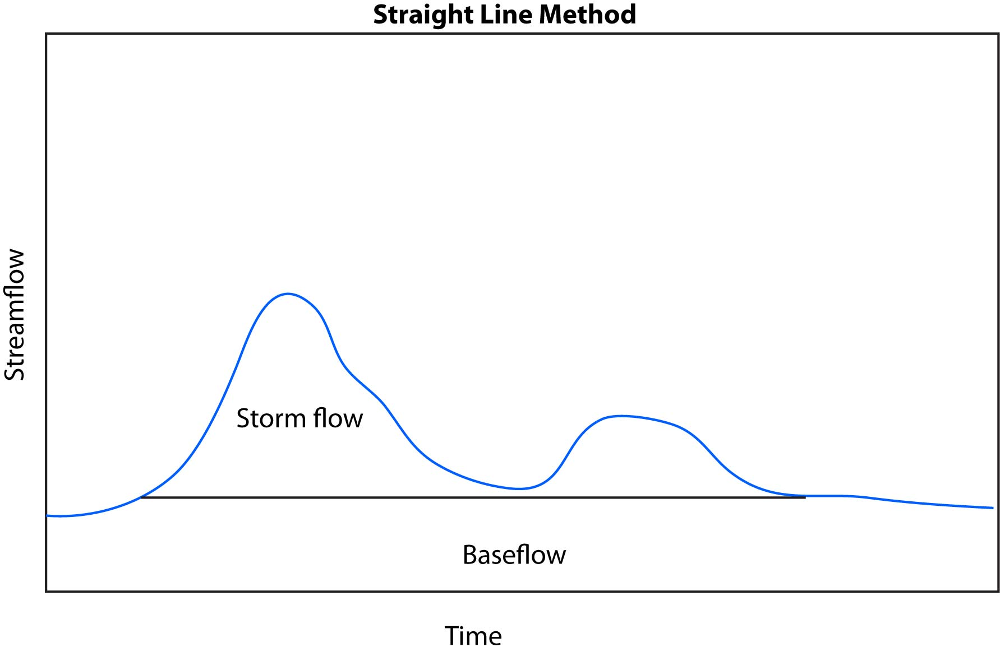
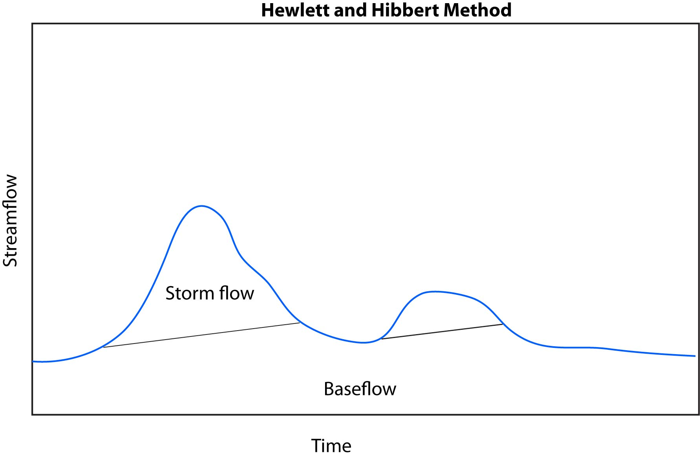
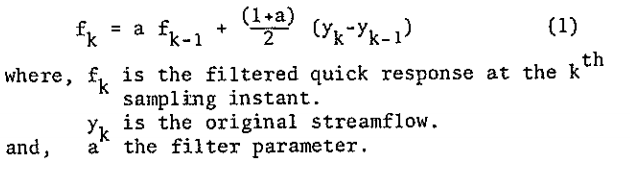
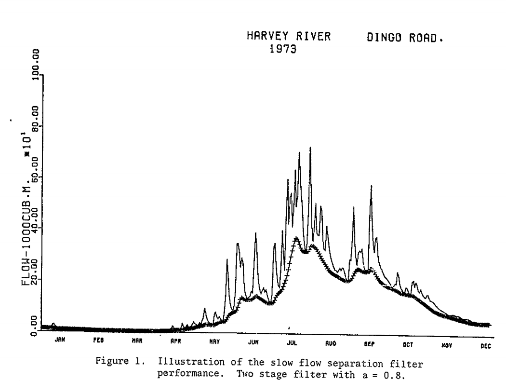

# Introduction

## Summary

Streamflow can come from a range of water sources. When it is not raining, streams are fed by the slow drainage of groundwater. When a rainstorm occurs, streamflow increases and water enters the stream more quickly. The rate at which water reaches the stream and the partitioning between groundwater and faster flow pathways is variable across watersheds. It is important to understand how water is partitioned between fast and slow pathways (baseflow and stormflow) and what controls this partitioning in order to better predict susceptibility to flooding and if and how groundwater can sustain streamflow in long periods of drought.

In this module we will introduce the components of streamflow during a rain event, and how event water moves through a hillslope to reach a stream. We will discuss methods for partitioning a hydrograph between baseflow (groundwater) and storm flow (event water). Finally, we will explore how characteristics of a watershed might lead to more or less water being partitioned into baseflow vs. stormflow. We will test understanding through evaluating data collected from watersheds in West Virginia to determine how mountaintop mining, which fundamentally changed the watershed structure, affects baseflow. 

Note: While this assessment is written for watersheds in West Virginia, we have designed the course so it is adaptable. Instructors should be able to easily substitute in their own data for the assessment. 

## Overall Learning Objectives:

At the end of this module, students should be able to describe the components of streamflow, the basics of how water moves through a hillslope, and the watershed characteristics that affect partitioning between baseflow and stormflow. 

# Lecture

<iframe width="560" height="315" src="https://www.youtube.com/embed/0gQZ1rOQeGo" frameborder="0" allow="accelerometer; autoplay; encrypted-media; gyroscope; picture-in-picture" allowfullscreen></iframe>

#  1.1: Components of streamflow during a rain event

During a rainstorm, precipitation is falling across the watershed: close to the stream, on a hillslope, and up at the watershed divide. This water that falls across the watershed flows downslope toward the stream via a number of flow pathways. Here we define and describe the basic flow pathways during a rain event.  
The first component is **channel interception**. This is water that falls directly on the water surface of the stream. The amount of water that falls directly on the channel is a function of stream size, if we have a very small, narrow creek, this will be a very small quantity. However, you can imagine that in a very large, broad river such as the Amazon, this volume of water is much larger. Channel interception is the first component during a rain event that causes streamflow to increase because it is contributing directly to the stream and therefore has no travel time. 

The second is **overland flow**, which is water that flows on the land surface to the stream. Overland flow can occur via a number of mechanisms which we will not explore too deeply here, but encourage further study on your own (resources provided). Briefly, overland flow includes water that falls on an impermeable surface such as pavement, water that runs downslope due to rain falling faster than the rate at which it can infiltrate the ground surface, and water that flows over the land surface because the ground is completely saturated. Overland flow is typically faster than water that travels through soils and deeper flow pathways and therefore is the next major component that starts to contribute to the increase in streamflow during a rain event. 

The third component is **subsurface flow**. This is water that infiltrates the land surface and flows downslope through shallow groundwater flow pathways. This is the last component that increases streamflow during a storm event, is the slowest of the stormflow components, and can contribute to elevated streamflow for a while after precipitation ends. 

The final component is **baseflow**. Baseflow can also be described as groundwater. This component is what sustains streamflow between rain events, but also continues to contribute during a rain event. Of water that infiltrates the ground surface, some moves quickly to the stream as subsurface flow, but some moves deeper and becomes part of deeper groundwater and baseflow. Thus baseflow can increase in times of higher wetness in the watershed, particularly during and right after rainy seasons or spring snowmelt. 

We can simplify this partitioning into **baseflow** and **stormflow** (often called quickflow). Baseflow being groundwater that moves more slowly and sustains streamflow between rain events. Stormflow is water that contributes to streamflow as a result of a rain event. Under this definition we can lump **channel interception, overland flow**, and **subsurface** flow into **stormflow**. 

#  1.2: Storm flow through a hillslope

  When rain falls on the land surface, much of it infiltrates into the soil. Water moves through the soil column until it meets a layer of lower permeability and runs down the hillslope as subsurface flow. This layer of lower permeability allows some water to move through it, contributing to groundwater. Frequently the layer of lower permeability is the interface between soil and rock. Therefore the depth of soil has a large effect on how much water moves through soil vs. how much moves deeper into groundwater, becoming baseflow. 

#  1.3: How we quantify baseflow 

It is impossible to know the amount of water moving as overland, subsurface, and base flow in all parts of a watershed. So in order to quantify how much water in a stream at any given time is storm flow vs. baseflow, we need to use some simplified methods. These frequently involve using the hydrograph (plot of streamflow over time) drawing lines, and calculating the volume of water above and below the line. This can be somewhat arbitrary and there are a variety of methods for delineating the cutoff between baseflow and stormflow. Despite what method you use and how simplified it is, this technique still provides valuable information and allows us to make comparisons across watersheds in order to understand how they function and what their structural properties are.

#  1.4: 

One of the most basic methods for calculating base flow vs. storm flow is the straight line method. First, find the value of discharge at the point that streamflow begins to rise due to a storm. A straight line is drawn at that value until it intersects with the hydrograph (i.e. streamflow recedes back to the discharge it was at before the rainfall event started. Anything below this line is base flow and anything above it is storm flow. 

We learned above that some rainfall can move deep into the soil profile and contribute to baseflow. We might expect baseflow to increase over time and thus would want to use a method that can account for this.  

An addition to the straight line method was posed by Hewlett and Hibbert, 1967. This method, which we’ll call the Hewlett and Hibbert method finds the discharge at the starting point of a storm. Then, rather than a straight line of 0 slope and in the straight line method, we assume a slope of 0.05 cubic feet per second per square mile. The line with this calculated slope is drawn until it intersects with the hydrograph receding at the end of the storm. 

There are myriad other methods for baseflow separation of a wide range of complexity. We will give an example of one more method: a recursive filter method established by Lyne and Hollick (1976). This method smooths the hydrograph and partitions part of that smoothed signal into baseflow. The equation for this method is: 

You can see from this equation that a filter parameter, a, must be chosen. This parameter can be decided by the user, takes a value between 0 and 1, and is typically close to 1. Additionally this filtering method must be constrained so that baseflow is not negative or greater than the total streamflow. Output from this method for the Harvey River in Australia is originally published in Lyne and Hollick (1976) below (notice in the caption that the a parameter was set to 0.8):    

#  1.5: 

The way a watershed is structured has a strong control on how water is partitioned into baseflow and stormflow. Below is a list of key structural properties: 
Land Use and Land Cover: If a watershed is developed or natural can dictate how much water infiltrates the land surface and how quickly. For example, a watershed with lots of pavement means that much more water will be overland flow with fewer opportunities to recharge baseflow. Furthermore, how a watershed is developed will affect partitioning. For example a residential area with houses on large, grassy lots will allow for more infiltration than a shopping center with large parking lots. Land cover in natural areas will also affect partitioning. Consider a dense forest vs. a recently harvested hillside. 
Soil type: clayey soils vs. sandy soils
Depth to impeding layer: could be the bedrock interface, but could also be a low permeability clay layer in the soil
Permeability of the underlying rock: Highly fractured sandstone vs. solid granite 
Slope: steeper slopes vs. flatter areas

The partitioning is a combination of all of these factors. A watershed may have a very low slope, suggesting that it might have less stormflow. But if the soils in this watershed have an impermeable clay layer near the soil surface, a lot more water may end up as stormflow than one would expect.  

# Assessment

To assess and improve your understanding we've developed two interactive 
applications. The first is an interactive web app that requires zero 
programming, and the second is a web-page that walks through baseflow
analyses in the R programming language. 

## Interactive application and questions: 

This interactive web application
highlighting how a major disturbance (mountaintop-mining) can change
how water moves through a system. The web app is here:
[https://cuahsi.shinyapps.io/mtm_baseflow/](https://cuahsi.shinyapps.io/mtm_baseflow/)

### Initial data exploration

  1. In the geomorphology tab, click on each of the four watersheds in the map on the left to view a 3-D rendering of its topography and read about its characteristics.Compare and contrast the watershed structure of the paired watersheds (both large and small). Describe the topography and the slope and soil characteristics. 
  

  2. Click on the baseflow tab and make sure you have “Flow separation at each site” selected in the choose baseflow data display drop-down menu. 
Describe which line is baseflow and how you would estimate total storm flow for an event.

  3. Zoom into the storms that occurred between 3 Apr and 19 Apr.  
Compare the overall shape of the hydrographs. Which watersheds have higher peaks? How do the peaks change over successive storms? 

  4. Move your cursor over the hydrographs and look at the values displayed in the top right corner of each graph. 
Determine if the reference or mined watersheds have higher baseflow. Describe how the baseflow changes over time in successive storms. 

2. Synthesis Questions

  1.  What do you think is happening in the hillslopes to cause the baseflow to change over time in successive storms? 
  
  2. Describe how differences in watershed structure might contribute to the differences in baseflow between the mined and unmined watersheds. (Use the findings of Hewlett & Hibbert, section 5 to guide your answer). 

  3. Look at the specific conductance tab and look at the mined vs. unmined. Describe the differences between the two. How do these data support some of your conclusions above? 
  
  4. What would you expect a hydrograph for a watershed in hawaii (Steep slopes, shallow soils) to look like? Would it have relatively high or low baseflow? What about a watershed in Southern Michigan (low slopes, deep soils)? 

## Data analysis

The second part of the assessment focuses more on directly 
analyzing discharge data using the R programming language. While
no R background is required, it will make the work a lot easier. 
The homework can be found linked below:

[https://cuahsi.shinyapps.io/1_baseflow_vs_stormflow/](https://cuahsi.shinyapps.io/1_baseflow_vs_stormflow/). 
