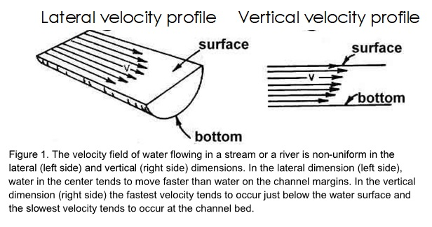
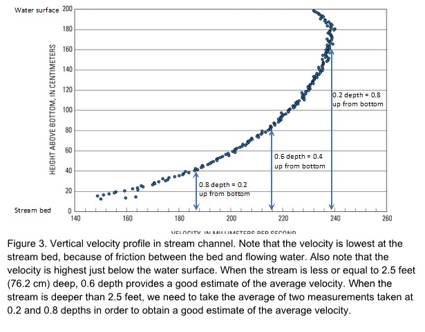
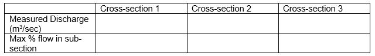

# Summary

In this module, we describe the approach, equations, and variables needed to determine stream discharge using the velocity-area method. We explain how the velocity profile changes laterally and vertically. We demonstrate how to measure velocity with both the float method and with a velocity current meter and top-setting wading rod. Finally, we review the USGS measurement guidelines and explore the sources of error associated with this approach. Additionally, students will work in teams to collect data at a local field site applying these methods to collect data and complete discharge calculations.

## Overall Learning Objectives: 

At the end of this module, students should be able to accurately use the velocity-area method in the field to collect data and calculate discharge of a stream.

## Required Reading

+ [Dingman 2002](https://www.dropbox.com/s/lnsrr32039k02p2/Dingman_2002_Appendix_F.pdf?dl=0){target="_blank"}

# Lecture

<iframe width="560" height="315" src="https://www.youtube.com/embed/hgPoorCAAGg" frameborder="0" allow="accelerometer; autoplay; encrypted-media; gyroscope; picture-in-picture" allowfullscreen></iframe>

## 1.1: Variability in stream velocity

The velocity of a stream or river is not uniform laterally or vertically across a profile (Figure 1). The minimum velocity in a vertical profile tends to occur at the streambed, the maximum velocity tends to occur just below the water surface. Furthermore, the minimum velocity in a lateral profile tends to occur at the channel margins and the maximum velocity tends to occur in the center, or thalweg, of the channel. The thalweg is defined as the deepest, fastest portion of the channel and generally occurs in the middle of the river or stream. 

A common way to measure stream discharge is with the velocity-area method. With this method we determine the cross-sectional area (width x depth) and velocity of a stream or river. The product of cross-sectional area (e.g., $m^{2}$) and velocity (e.g., $m/s$) is discharge in units of volume per time (e.g., $m^{3}/s$).

To do so we measure the width, depth, and velocity at many (~25) locations along a cross-section of stream or river (Figure 2). The goal of dividing the cross-section into many (~25) sub-sections is to capture the variability in flow across the cross-section and obtain a more accurate discharge measurement. 

## 1.2: Steps to making velocity-area measurements

First, we locate a cross-section with convergent flow, few obstructions or eddies, that is safe to wade across. Once we have selected a cross-section we then begin taking our measurements moving laterally across the channel. When doing so we aim to have no more than 5% of the total flow in any sub-section (Figure 2). A decent rule of thumb is to take ~25 measurements of width, depth and velocity across the cross-section. Keep in mind that we are aiming to have no more than 5% in any sub-section, so we can space our measurements closer together where there is more flow (e.g., in the thalweg) and farther apart where there is less flow (e.g., on channel margins).  

## 1.3: The top-setting wading rod

To determine stream discharge we typically measure velocity using a current meter and a top-setting wading rod. As a side-note, in the absence of this equipment, velocity (and discharge) can be estimated using the float method (see ‘Float method’ below). The top-setting wading rod is useful because it helps us to set the current meter to the ‘correct’ depth for measuring average velocity. 

see supplemental video here:

<iframe width="560" height="315" src="https://www.youtube.com/embed/YUzyt8I-Svs" frameborder="0" allow="accelerometer; autoplay; encrypted-media; gyroscope; picture-in-picture" allowfullscreen></iframe>

For example, when the stream is 2.5 feet (76.2 cm) deep or shallower, we can use the six-tenths depth method as this has been empirically determined to be a good representation of average velocity along a vertical profile in streams that are less than 2.5 feet deep. In deeper rivers we need to take two velocity measurements: one at two-tenths and one at eight-tenths depth and then average these two values in order to get a representative value for average velocity along the vertical profile. Accordingly, when the stream is less than 2.5 feet deep you will use the six-tenths depth method; and when it is deeper than 2.5 feet you will use the 0.2 and 0.8 method. As a note, six-tenths depth is four-tenths up from the bottom (see Figure 3). 

## 1.4: To use the top setting wading rod

The depth of the water is read on the graduated hex main rod. Then the round setting rod is adjusted to the depth of the water, the current meter is automatically positioned for the 0.6-depth method (0.4-depth position up from the streambed). Setting the unit to half the water depth will place the meter at the 0.8-depth (0.2-depth position up from the streambed). Conversely, setting the unit to twice the water depth will place the meter at the 0.2-depth (0.8-depth position up from the streambed). The latter two positions correspond to the conventional two-position method. 

## 1.5: Steps to making velocity-area measurements

First, we locate a cross-section with convergent flow, few obstructions or eddies, that is safe to wade across. Once we have selected a cross-section we then begin taking our measurements moving laterally across the channel. When doing so we aim to have no more than 5% of the total flow in any sub-section (Figure 2). A decent rule of thumb is to take ~25 measurements of width, depth and velocity across the cross-section. Keep in mind that we are aiming to have no more than 5% in any sub-section, so we can space our measurements closer together where there is more flow (e.g., in the thalweg) and farther apart where there is less flow (e.g., on channel margins). 

see supplemental video here:

<iframe width="560" height="315" src="https://www.youtube.com/embed/kx9LJQ3JuLA" frameborder="0" allow="accelerometer; autoplay; encrypted-media; gyroscope; picture-in-picture" allowfullscreen></iframe> 

# Field work

Now that you have an understanding of the velocity-area method, work with your field team to take measurements at a field site of your choosing. Note: you will collect your field data together with your group members, but each person will submit their own responses to the **Assessment** and **Field Data Analysis and Synthesis Questions** sections. 

Materials:

1. Field tape 

2. Orange

3. Notebook

4. Stopwatch

5. Current meter and wading rod

6. Rebar

### 2.1: Float Method

1.	Along the experimental reach, select a section of thalweg that is about 20 meters long and free of obstructions.

2.	Measure the distance so you know the travel length exactly.

3.	Release an orange and time how long it takes to travel across the length you have measured out.

4.	Repeat this 5 times in order to get an average.

5.	*Remember that the surface velocity is higher than the average velocity so we generally scale the surface velocity by 0.85 to approximate the average velocity.

### 2.2: Velocity Area Method

1.	Along the experimental reach, select an appropriate cross-section for making a discharge measurement. Keep in mind the criteria that an ideal section has: **uniform, straight flow, relatively little turbulence, few if any obstructions, no eddies, and it is SAFE to wade across**. String your field tape across your cross-section with rebar stakes at each bank.
 
2.	Measure the stream discharge at your designated cross-section, using about 25 subsections, and velocity measurements at 0.6 times the depth at the midpoint of each subsection. If the stream or river you are measuring is more than 2.5 feet deep you should take velocity measurements at 0.2 and 0.8 depths. You should aim for no more than 5% of the flow in any one segment of your cross-section.

3.	Repeat Step 2 two additional times in order to give all your teammates an opportunity to use the current meter. Change the spacing of your 25 measurements along your cross-section to test what works best in order to meet the USGS requirement of less than 5% of flow in each cell.

4.	Thalweg vertical velocity profile:

    a.	In the thalweg use a current meter to quantify the vertical velocity distribution. 

    b.	Be sure to record velocities at 0.2, 0.6, and 0.8 times the depth.

    c.	Try to get a velocity measurement at as many depths as possible. 

    d.	See Figure 3 for an example of a vertical velocity profile:

# Assessment (20 pts) 
Calculations using pre-collected data provided [here](https://www.dropbox.com/s/pp7spwyk9maa4ul/Velo_Area_Assessment.xlsx?dl=0 ){target="_blank"} 

### 3.1: Velocity Area Method (Continued)

Use the provided field data to answer the following questions. Note highlighted green rows and columns are data that have been collected in the field. Yellow highlighted rows and columns are what you will be solving for following the directions below:

**1.	Use the provided float velocity data to generate the following table (5 pts) **

   

a.	What does multiplying by 0.85 achieve?

**2.  Use provided cross-section data to generate the following table (10 pts) **

a.	Does this meet USGS Standards? If not, how could you collect this data differently to ensure that it meets the USGS standards?

**3.	Compare data (5 pts) **

a.	How does the mean velocity from part 2 compare to the mean float velocity from part 1? Explain why these values differ.

b.	Why might you want to use the float method instead of the velocity-area?

### Field Data Analysis and Synthesis Questions: Using your field-collected data (40 pts)

Use the data you collected in the field work section to answer the following questions

**Question #1: Velocity-Area Discharge (15 pts) ** 

a.	Generate the table below with the following information for the 3 velocity area cross-sectional measurements of streamflow that you collected in the field. (5 pts)

    + Measured discharge.
    + The highest percent flow in a sub-section of the cross-section.

b.	Discuss if your measurements meet the USGS Standards? Why or why not? (5 pts)

c.	What are the three greatest sources of error in the discharge values derived from your velocity-area measurements? (5 pts)

**Question #2: Velocity Measurements (25 pts)**

a.	Create a graph of the vertical velocity profile with the velocities you recorded at different depths. (5 pts)

b.	Generate the table below  comparing the thalweg velocities measured using the following techniques: (5pts)

    +	Velocity at 0.6 times the depth;
    +	Mean velocity using 0.2 and 0.8 times the depth;
    +	Mean velocity using all three depths (0.2, 0.6, and 0.8); and
    +	Mean float velocity times 0.85.
    
    
  
c.	Comment on the comparability of measures obtained from each of the four techniques used to measure velocity. Do you get reasonable velocity values from low-cost approaches such as float method? Conversely, do you obtain much better data from the expensive current meter? Provide an example of a situation where you would recommend: float, and current meter. (5 pts)

d.  You have a thalweg profile; we use 0.6 depth to approximate the average vertical velocity when making velocity area Q measurements. Use your data to determine if this assumption is valid for your measurements. (10 pts)

